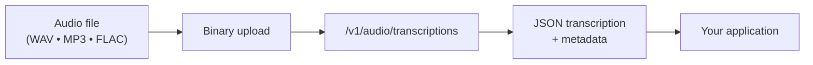

# File Documentation: speech-to-text-not-streaming.mmd

## File Metadata
- **Path**: `examples/mermaid/speech-to-text-not-streaming.mmd`
- **Size**: 260 bytes (256 characters)
- **Lines**: 7
- **Extension**: `.mmd`
- **Classification**: text

---

## Original Source

```

```

---

## High-Level Overview

This is a text file with extension `.mmd`.

---

## Detailed Walkthrough

---

## Performance & Security Notes


---

## Related Files

See the folder index for related files in the same directory.

---

## Tests / How to Run

Refer to the project README for instructions on how to use this file.

---

*Documentation generated for `examples/mermaid/speech-to-text-not-streaming.mmd`*
