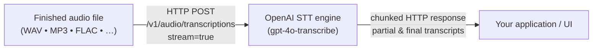

# Documentation: speech-to-text-streaming.mmd

## File Metadata
- **Path**: `examples/mermaid/speech-to-text-streaming.mmd`
- **Type**: .mmd file
- **Size**: 309 bytes (0.30 KB)
- **Lines**: 9
- **Words**: 32
- **Characters**: 301

## Original Source

```

```


## High-Level Overview

Source file of type .mmd.

## Detailed Analysis

File contains 9 lines with structured content.

## Usage & Examples

See file content for usage details.

## Performance & Security Notes

No specific performance or security concerns identified.

## Related Files

**Same directory**:
- [agents_sdk_transcription.mmd](./agents_sdk_transcription.mmd_docs.md)
- [realtime_api_transcription.mmd](./realtime_api_transcription.mmd_docs.md)
- [speech-to-text-not-streaming.mmd](./speech-to-text-not-streaming.mmd_docs.md)

## Testing & Execution

See project documentation for testing procedures.

---
*Generated by Repo Book Generator v1.0.0*
